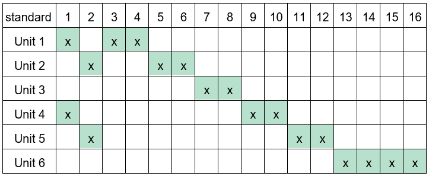

# Advanced Automation

A custom made course at SSIS thanks to the great support of Evan Weinberg [@emwdx](https://github.com/emwdx)

## Unit 1: [Functions and Modular Code](./unit1)

1. [Welcome to Advanced Automation](https://github.com/kreier/aa/tree/main/unit1#1-welcome-to-advanced-automation)
2. [Introduction to Functions](https://github.com/kreier/aa/tree/main/unit1#2-introduction-to-functions)
3. [Shock Detector Case Study](https://github.com/kreier/aa/tree/main/unit1#3-shock-detector-case-study)
4. [Mastery Check - Sketch of Functions](https://github.com/kreier/aa/tree/main/unit1#4-mastery-check---sketch-of-functions)
5. [Making Code Modular](https://github.com/kreier/aa/tree/main/unit1#5-making-code-modular)
6. [Module Maker - Creating modular code yourself!](https://github.com/kreier/aa/tree/main/unit1#6-module-maker---creating-modular-code-yourself)
7. [Drink Machine Part I](https://github.com/kreier/aa/tree/main/unit1#7-drink-machine-part-i)
8. [Drink Machine Part II](https://github.com/kreier/aa/tree/main/unit1#8-drink-machine-part-ii)
9. [Drink Machine Testing Software](https://github.com/kreier/aa/tree/main/unit1#9-drink-machine-testing-software)

## Unit 2: [Managing State](./unit2)

1. Binary Secret Code - Introduction to Abstraction
2. Three Boards, Three Flavors
3. Introduction to State Machine Programming - Escape to Summer Case Study
4. Drink Dispenser State Machine
5. Building a Physical Drink Dispenser State Machine
6. Iterative Design
7. Choosing your system 
8. Microwave State Program 
9. Inputs, Outputs, Hardware
10. Levels of Abstraction I
11. Levels of Abstraction II

## Unit 3: [Collaborative Code and Generative Art](./unit3)

1. Generative Art and the Circle K Project
2. Design Project 
3. Branches, Forks, and Pull Requests 
4. Circular Art
5. Idea Sharing for the Generative Art Project 
6. Project Check-In 
7. Design Project Submission 
8. Singular Collaborative Art Project 
9. Work on Collaborative Art Project 
10. Work on Collaborative Art Project 
11. Design Project Submission 
12. Singular Collaborative Art Project 
13. Singular Collaborative Art Project 
14. Singular Collaborative Art Project 
15. Singular Collaborative Art Project 
16. Explanation of Winter Break Assignment 

## Unit 4: [Control Algorithms and APIs](./unit4)

1. Introduction Control Systems Board
2. Carrier board rp2040 - physical and electrical connection
3. The I2C Bus 
4. Activate the OLED display 
5. Control Algorithms 
6. Digital states and Pulldown Resistors 
7. Repositories for Control Systems 
8. The PID controller 
9. VEX VR Control Systems Task 
10. Water Flow Controller and Landing a Rocket 
11. APIs and Libraries 
12. Sphero RVR API 
13. Control Challenge 2022-2023 
14. Documentation on Design Decisions 
15. On the Field: Control Systems and API Challenge 
16. Final test for the Sphero RVR challenge on the field 

## Unit 5: [Machine Learning and Modifying Code](./unit5)

1. Sketch Classifier 
2. Improving the Classifier 
3. Self Driving Car Activity 
4. Iterative Design 
5. Evaluating Algorithms and Standards 
6. Machine Learning Project - Objective and Dataset 
7. Machine Learning Project - Algorithm and Training Data 
8. Machine Learning Project - Training the Model 
9. Work on Project Unit 5: Standard 2, 11 and 12 
10. Project Unit 5 completion 
11. Presentation of Unit 5 projects 
12. Refine presentations for art party “RESET” 

## Unit 6: [Measurement and Data Processing](./unit6)

1. Collecting Data 
2. The Color Wheel 
3. Fan Tachometer Revisited 
4. Thresholded data and Pulse Width 
5. From csv to continuous read 
6. Morse Code Project 
7. Individual project 
8. Semester 2 Iterative Design 
9. Continuous Read with the Circuit Playground Express 
10. Project refinement for Unit 6 
11. Presentation of Unit 6 projects 
12. Reflection on achievements

## Standards

The first **two standards** are a separate category with 33% weighting each. The remaining 12 standards fall into the third category, CSE Power Standards (Computer Science and Engineering) and the respective Advanced Automation standard rubrics.

1.	**Document* design decisions using text, graphics, presentations, and/or demonstrations in the development of complex programs.
2.	**Design** and **iteratively develop** computational artifacts for practical intent, personal expression, or to address a societal issue by using events to initiate instructions. 
3.	Decompose problems into smaller components through systematic analysis, using constructs such as procedures, modules, and/or objects. 
4.	Construct solutions to problems using student-created components, such as procedures, modules and/or objects.
5.	Illustrate ways computing systems implement logic, input, and output through hardware components.
6.	Compare levels of abstraction and interactions between application software, system software, and hardware layers. 
7.	Justify the selection of specific control structures when tradeoffs involve implementation, readability, and program performance, and explain the benefits and drawbacks of choices made.
8.	Design and develop computational artifacts working in team roles using collaborative tools.
9.	Create prototypes that use algorithms to solve computational problems by leveraging prior student knowledge and personal interests. 
10.	Demonstrate code reuse by creating programming solutions using libraries and APIs.
11.	Modify an existing program to add additional functionality and discuss intended and unintended implications (e.g., breaking other functionality)
12.	Implement an artificial intelligence algorithm to play a game against a human opponent or solve a problem.
13.	Use lists to simplify solutions, generalizing computational problems instead of repeatedly using simple variables.
14.	Create artifacts by using procedures within a program, combinations of data and procedures, or independent but interrelated programs. Create procedures with parameters to organize code and make it easier to reuse.
15.	Develop guidelines that convey systematic troubleshooting strategies that others can use to identify and fix errors.
16.	Evaluate and refine computational artifacts to make them more usable and accessible.
