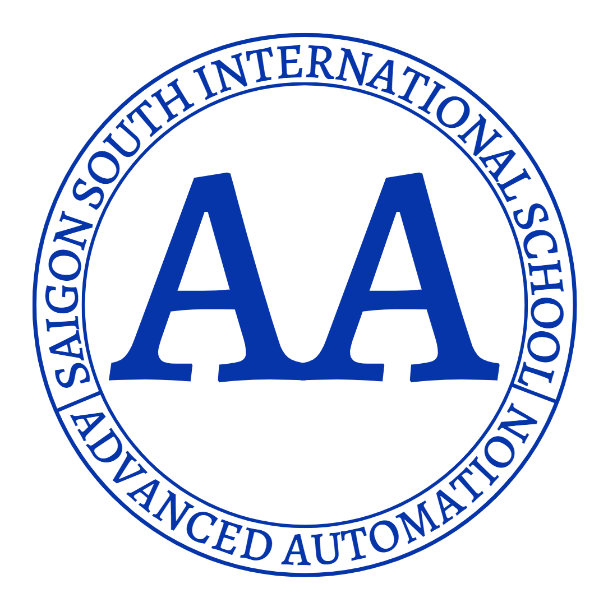
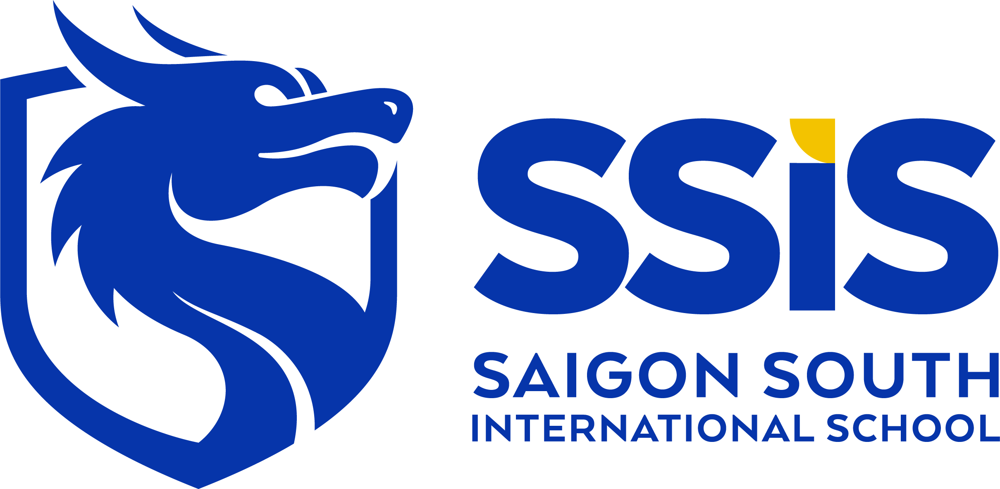

# Advanced Automation

Overview

### Unit 1

# Functions and Modular Code

### Unit 2

# Managing State

### Unit 3

# Collaborative Code

### Unit 4

# Control Algorithms and APIs

### Unit 5

# Machine Learning

### Unit 6

# Measurement and Data Processing

Documents:

# Images

